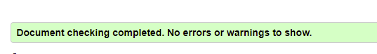

# Geography Quiz

Link to the project: https://github.com/MariuszKaminski/Milestone-Project-2/

___
## Table of Contents

[Introduction and Purpose](#introduction-and-purpose)

[Problem Statement](#problem-statement)

[Analysis](#analysis)
  * [Feasibility Study](#feasibility-study)
  * [Functional Requirements](#functional-requirements)
  * [Non-functional Requirements](#non-functional-requirements)
  * [User Experience](#user-experience)
    * [Target Audience](#target-audience)
    * [User Stories](#user-stories) 

[Wireframes](#wireframes)

[Design Considerations](#design-considerations)

[Features](#features)

[Implementation and Coding](#implementation-and-coding)

[Testing](#testing)

[Deployment](#deployment)

[Validation](#validation)
  
[Evaluation](#evaluation)

[Credits](#credits)

---

## Introduction and Purpose

This project has been created as Milestone Two project for my Diploma Level 5 in Web Development, a course run by Harlow College in association with Code Institute. 
In this file you will find documentation related to a web application coded in Javascript called 'Geograpy Quiz'. The quiz aplication generates random questions about geographical features of countries such as their capitals, longest rivers, tallest mountains as well as which continent they are situated in. The purpose of 'Geography Quiz' web page is educational as a resource for teachers and students for rehearsing material or for general public that would like check their general knowledge in the field of geography.

## Problem Statement

Design, implement and deploy an online resource that can be recommend by teachers to their pupils/students in the form of a quiz with guestions and multiple choice answers. The questions and answers should be randomized and the set of answers should contain only one correct answer. The web page with the quiz needs to provide their users with feedback
which includes pop up messages informing the user whether the chosen answer is correct or not. In the case of incorrect answer the pop-up should provide the users with a correct answer, so that some learning could occur. Additionally, the quiz web page should count the score for both correct and incorrect answers.

## Analysis

### Feasibility Study:
1.	As teaching and learning increasingly happens online. A custom built web application could provide a safe and hassle free way for the pupils/students to rehearse the material.
2. The quiz could be one of a growing number of online resources that the school would like to offer their students free of charge.	
 
### Functional Requirements
1.	It must be functional on PCs and mobile devices.
2.	It has to be intuitive and easy to navigate.
3.	It has to test general knowlegde in the subject area of Geography.
4.	It needs to provide ceratin variety.
5.	It should facilitate learning and entertain.

### Non-functional Requirements
1.	Website completion deadline: 11th of November, 2021
3.	The application should utilize HTML5, CSS3 and JavaSrcipt technologies.
4.	The application should be easy to modify and expand.
5.	The application should complement school's other online resources.
6.	The web page/application should aesthetically pleasing and provide good user experience.

## User Experience 

### Target Audience
* Pupils/students who have been referred to access the quiz by their teachers as an in-class activity or at home to aid their learning.
* General public - anyone who wishes to check their facutal knowledge in the field of Geography.

### User Stories:
* As a pupil/student I can easily interact with the game.
* As a accidental visitor I would like to test my general knowledge in the field of Geography

## Wireframes

### Desktop version

### Mobile version

## Design Considerations

### Design ideas:
The design is primarily based on Code Institute’s “Love Maths” tutorial by Anna Greaves. It is true to say that I have used the tutorial as a starting point, however while I was working on it and trying to addapt it to my ideas, I had to introduce extensive changes both to the appearance and the code. I have retained the idea of 4 buttons for different game types and the submit button for checking answers. The whole question area has been remodelled to be textbased with radio buttons used to provide ansers instead of input boxes for numbers.  

### Design details

The web application, in its entirety, utilizes Google Font “Ubuntu”. The colour used for the game area background is ##00FFBF (aquamarine) while the logo next to heading is a [clipart](http://www.clipartpanda.com/clipart_images/clip-art-geography-17521220) sourced from [ClipartPanda](http://www.clipartpanda.com/).

## Features

### Game type buttons

The buttons are a one of the key application features as they enable the user to change the type of game questions. The default game type that the aplication offers on loading the web page is "Capitals", however swiching to any of the other three reamining game types requires the user to click a corresponding button.

### Question area
\
This area displays a quiz question relevant to the game type with randomly selected country name. Below the question the user is presented with a choice of three answers, one of which is correct. The user makes their selection by clicking a corresponding radio button.

### Submit button

Once clicked, the submit button triggers a number of actions. Firstly, the answer is verified. Secondly, depending on whether the answer is correct or not, the user receives an appropriate pop up message and the score is adjusted. Lastly, a new question and answers of the same game type are generated. 

### Game score area

This area keeps track of the user's progress by displaying the current number of correct and incorrect answers.

## Implementation and Coding

The entriety of code for the purpose of this project has been in GitPod. The web page structure and content is delivered by means of HTML while visual styling, positioning and responsivnes to diffrent screen sizes is achieved by means of CSS. JavaScript code has been employed to turn the Quiz page into a web based application that responds accordingly to the user's actions. I have aimed to write and space the code in orderly neat manner and provide helpful comments, which is a good practice recommended by Code Institute in their learning tutorials. This applies to both CSS and Javascript files where appropriate class names or function names have been used that hint at their purpose. All of this to enhance the readability of the code to other people who might be reviewing it.

## Technologies Used

* [HTML5](https://en.wikipedia.org/wiki/HTML5) used to provide the site with content.
* [CSS3](https://en.wikipedia.org/wiki/CSS#CSS_3) used to style the HTML content.
* [Javascript](https://en.wikipedia.org/wiki/JavaScript) used to power the application features.
* [Balsamiq](https://balsamiq.com/) used for the creation of wireframes for the site.
* [Google Chrome Developer tools](https://developer.chrome.com/docs/devtools/) used to test site responsiveness and to test code.
* [Github](https://github.com/) used as the repository hosting service.
* [Gitpod](https://www.gitpod.io/) an online base code editor used for writing code and tracking changes.
* [Code Institute Gitpod Full Template](https://github.com/Code-Institute-Org/gitpod-full-template) used to as a template for the creation of the project repository.
* [W3C Markup](https://validator.w3.org/) used for HTML validation.
* [Jigsaw validation](https://jigsaw.w3.org/) used for CSS validation.

## Testing
1. As a new user I can easily gues how it works.
* Result: PASSED
  * The application has a straightforward look that resembles standard multipulple choice tests.
2. The user can easily swich to a different game type.
* Result: PASSED
  * Pressing each of the button does ruesult in a change of queston type.
3. The user can be sure that one of the answers provided is correct.
* Result: PASS
  * The code ensures that one of the answers is correct in realtion to the country mentioned in the question.
4. The user gets pop up messages stating whether the selected anwer is correct or incorrect.
* Result: PASSED
  * Pressing the submit button does result in displaying  a relevant message.
5. In case of incorrect answer, the user gets a hint what the correct answer is.
* Result: PASSED
  * Selecting incorrect answer and pressing the submit button does display a message with correct answer.
6. The user can see their progress represented by numbers of correct and incorrect answers given.
* Result: PASSED
  * The application does update the score by increasing either the number of correct answers of incorrect ones. 
7. After answering a guestion the user gets a new question that differs from the previous one.
* Result: PARTIALLY PASSED
  * The application will generate a new question, however due to the limited number of countires in the applictation's array (which is 28) there is a slight chance a given country might be repeated.
8. The radio button checked by the user will be unchecked before a new question is generated.
* Result: PASSED
  * The application does automatically uncheck radio buttons before generating new question.

## Validation

### HTML
Pasting the code into [W3C Markup Validation Service](https://validator.w3.org/#validate_by_input) has returned the following result:
* index.html  

### CSS
Pasting the code into [W3C CSS Validation Service](https://jigsaw.w3.org/css-validator/validator.html.en#validate_by_input) has returned the following results:
* style.css  

### JavaScript
I have also attempted to validate the javascript code through [ValidateJavaScript](https://validatejavascript.com). However, this resulted in a long list of errors that do not appear to prevent the code from functioning properly. Similar errors appear to exist in the original "Love Maths" javacript code and, in my belief, they might be the result of Code Institute being more up to date with the new developments in JavaScript or trying to simplify the process of learning.

## Deployment
After final commit to Git via Gipod, the website has been deployed online at Git Pages through a standard GitHub procedure. Below are the steps taken:\
 
Enter the Github repository “Project Milestone 2” -> Settings -> Pages ->Source-> (branch) Master-> (folder) /root-> Save
 
The web application is now publicly accessible at this URL address: https://mariuszkaminski.github.io/Milestone-Project-2/
 
## Evaluation

As stated before the starting point for this project was Code Institute Love Maths walkthrough, however my own idea of changing the subject of the game from mathematics to geography proved to be very challenging. Firstly, the code had to be extensively modified to deal with arrays, objects and arrays of objects instead of numbers. Secondly, using radio buttons for selecting text based answers presented its own challenges. What is more, ensuring that one of the answers is correct and avoiding repetitions also required 
While the work on the project has been frustrating at times, it has been a good exercise in problem solving.

## Credits

### Sources for code solutions:

[Code Institute](https://codeinstitute.net/)
* [Love Maths Tutorial](https://github.com/Code-Institute-Solutions/love-maths-2.0-sourcecode)

[Stack Overflow](https://stackoverflow.com/)
* [JavaScript - Output random OBJECT from array of objects](https://stackoverflow.com/questions/37167264/javascript-output-random-object-from-array-of-objects)
* [From an array of objects, extract value of a property as array](https://stackoverflow.com/questions/19590865/from-an-array-of-objects-extract-value-of-a-property-as-array)
* [How to randomize (shuffle) a JavaScript array?](https://stackoverflow.com/questions/2450954/how-to-randomize-shuffle-a-javascript-array)
* [How do I get the label of the selected radio button using javascript](https://stackoverflow.com/questions/14709617/how-do-i-get-the-label-of-the-selected-radio-button-using-javascript)
* [Attach event listener through javascript to radio button](https://stackoverflow.com/questions/8922002/attach-event-listener-through-javascript-to-radio-button)

[JavaScript Tutorial](https://www.javascripttutorial.net/)
* [Remove Duplicates from an Array](https://www.javascripttutorial.net/array/javascript-remove-duplicates-from-array/)

[Techie Delight](https://www.techiedelight.com/)
* [Uncheck a radio button with JavaScript/jQuery](https://www.techiedelight.com/uncheck-radio-button-javascript/)

[Useful Angle](https://usefulangle.com/)
* [How to Search in an Array of Objects with Javascript](https://usefulangle.com/post/3/javascript-search-array-of-objects)

### Design ideas:

[Code Institute](https://codeinstitute.net/)
* [Love Maths Tutorial](https://github.com/Code-Institute-Solutions/love-maths-2.0-sourcecode)
